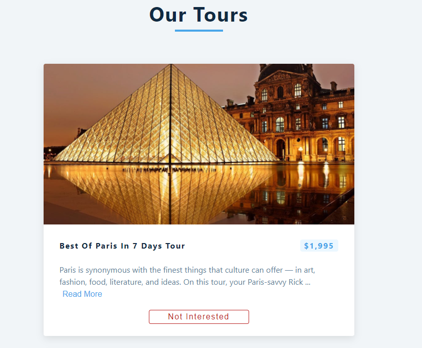
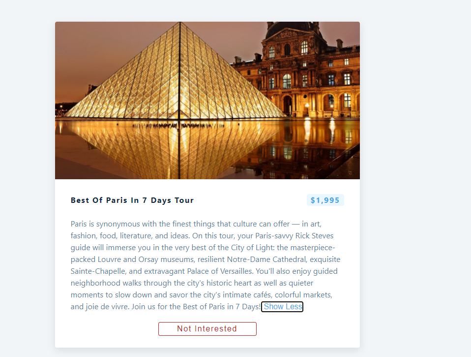
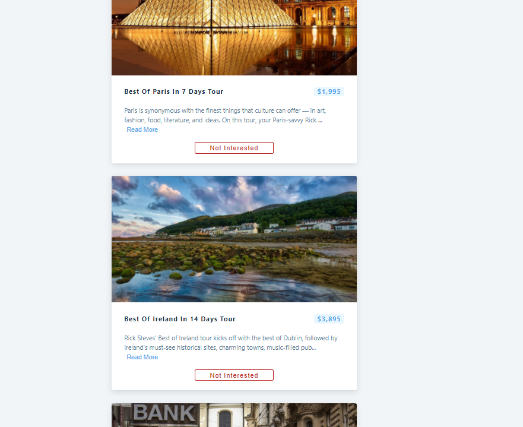
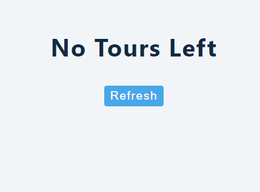

## React Project 2

## _TOURS_ USING _CONDITIONAL RENDERING_

  

- After Clicking the
  _Read More_ button

  

  

- After Clicking the
  _No Interested_ button in every Tour

  

- When You will click _Refresh_ button it will again the **fetch** the details of _Tours_ from the url.
